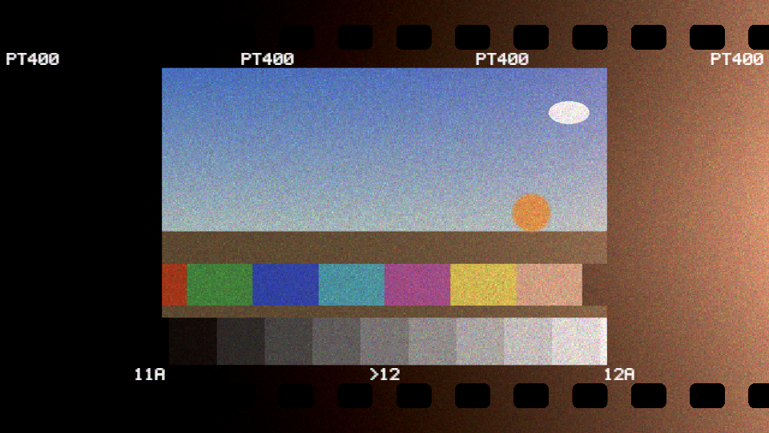
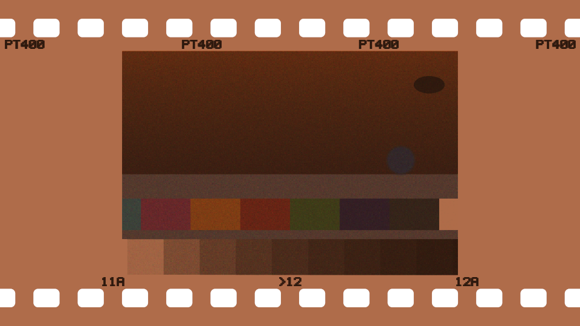
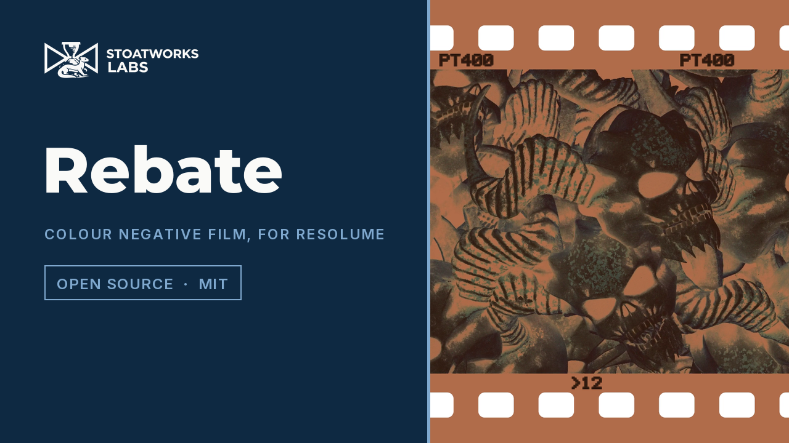

# rebate

> **AI-assisted project.** This codebase was created with [Claude](https://claude.com/claude-code)
> (Anthropic), directed and reviewed by a human author. The film is not asserted
> but measured: an offline harness drives the real plugin class in a headless GL
> context and reads each claim back out of the picture — a grey wedge's density
> climbs with slope γ and bends where the curve says, a neutral wedge through C-41
> with its orange mask inverts to neutral to 1e-6, grain's variance is
> c(1 − c)/N and peaks at c = 0.5 over 921,600 samples a field, one stop of push
> raises γ × 1.15 and fog by 0.03, a light leak rises and saturates on the
> shoulder and is warm, cross-processed film scans warm where the model says, the
> sprocket holes are black — with eleven negative controls that prove each check
> can fail. It has **never been loaded into Resolume on macOS**, where it is loaded by
> [oxbow](https://github.com/stoatworks-labs/oxbow), which is a real FFGL host and
> is not Resolume. On Windows, a build of v0.1.0 loads, registers and renders in
> Resolume Arena 7.27.1 with every control as declared, on software rendering. The
> [OpenFX build](#openfx--resolve-vegas-nuke-natron) renders the same film on the CPU
> and is checked against the shaders pixel for pixel. As a Fusion tool in DaVinci
> Resolve Studio 21.1 on macOS it renders what the fleet's command-line OFX test host
> does, to within 1/255; it has never been in Vegas, Nuke or Natron. See
> [Status](#status).

Colour negative film, and the scan of it, as an FFGL effect for
[Resolume](https://resolume.com) Arena and Avenue, and as an OpenFX plugin for
DaVinci Resolve, Vegas, Nuke and Natron.



<sub>One frame, rendered by `rbtest`, the offline harness — not captured from
Resolume. The 400-speed portrait negative on a 35 mm strip, with a leak.</sub>

<!-- downloads:start -->

## Download

**[v0.1.0](https://github.com/stoatworks-labs/rebate/releases/tag/v0.1.0)** — prebuilt for macOS and Windows. Pick your platform:

<details>
<summary><b>macOS</b> — Universal (Apple Silicon + Intel)</summary>

| Build | Download | Size |
| --- | --- | --- |
| Universal (Apple Silicon + Intel) · .dmg disk image | [`rebate-0.1.0-macos-universal.dmg`](https://github.com/stoatworks-labs/rebate/releases/download/v0.1.0/rebate-0.1.0-macos-universal.dmg) | 230 KB |
| Universal (Apple Silicon + Intel) · .zip archive | [`rebate-macos-universal.zip`](https://github.com/stoatworks-labs/rebate/releases/latest/download/rebate-macos-universal.zip) | 191 KB |

</details>

<details>
<summary><b>Windows</b> — x64</summary>

| Build | Download | Size |
| --- | --- | --- |
| x64 · .exe installer | [`rebate-0.1.0-windows-x86_64-setup.exe`](https://github.com/stoatworks-labs/rebate/releases/download/v0.1.0/rebate-0.1.0-windows-x86_64-setup.exe) | 226 KB |
| x64 · .zip archive | [`rebate-windows-x86_64.zip`](https://github.com/stoatworks-labs/rebate/releases/latest/download/rebate-windows-x86_64.zip) | 118 KB |

</details>

All builds, checksums and release notes: [github.com/stoatworks-labs/rebate/releases](https://github.com/stoatworks-labs/rebate/releases).

macOS builds are signed and notarised and open normally. The Windows builds are unsigned, so SmartScreen warns once.

<!-- downloads:end -->

## The one idea

A film look is usually a lookup table. This is the process.

The clip is the **scene**. It exposes the three dye layers of a colour negative
through the overlap of their spectral sensitivities. Each layer is developed along
a characteristic curve — a toe, a straight line of slope γ, a shoulder — into dye.
The dyes are impure, so the film carries masking couplers that cancel their
impurities, which is why a negative is orange. The dye is made of clouds in grain
cells. Then the flat orange negative is **scanned and inverted**, the way a lab
scanner does it: divide by the base, set the levels, invert.



<sub>`View: Negative` — what is on the film before the scanner inverts it.</sub>

## What falls out

None of these is drawn. Each is one stage of the process doing what it does:

- **The orange negative.** The mask: coloured coupler wherever dye did not form,
  carrying exactly the unwanted absorption that dye would have had. `View: Negative`
  shows it; the scanner divides it out.
- **Grain in the mid-tones.** Each cell holds N sites a dye cloud may land on, so
  the covered fraction's variance is c(1 − c)/N: largest at mid density, zero in
  clear shadows and blocked highlights. Nothing is tuned to put it there. `Stock`
  sets N, `Grain Size` the cell.
- **Blue shadows on expired stock.** Age fog is an exposure (radiation and heat in
  storage), it goes through the curve so it lifts the shadows and not the
  highlights, and the top, blue-sensitive layer takes the most of it. Scanned with
  the stock's normal profile, the blacks go blue and the highlights warm.
  `Auto Levels` — the lab re-measuring the roll — takes most of it back out.
- **The warm light leak.** Light through the base reaches the red-sensitive layer
  first. It is an exposure, so it saturates on the shoulder instead of adding
  without limit, and it fogs the rebate along with the picture.
- **Cross-processing.** Reversal film through C-41: no masking couplers, a steep
  curve, and a scanner that divides by an orange mask that is not there. The
  positive goes warm, most in the shadows, and the shift shrinks toward the
  highlights where the mask it expected would have been used up.
- **The rebate.** Unexposed film around the frame, which prints black; the edge
  print, pre-exposed at manufacture as a latent image, which prints light on it;
  the sprocket holes, clear, which clip to black. The stock codes and frame numbers
  are invented. No real manufacturer's name or mark appears anywhere.

### The honest limit

The model is three layers with one curve shape between them, a 3×3 spectral
crossover and a 3×3 dye-impurity matrix: enough for every mechanism above, not a
spectral simulation of any real stock. The stocks are invented and described by
their parameters (γ, grain sites, fog, age), not measured from anything. Grain is
per output pixel rather than per micron of film, so it does not scale with the
frame. Real development has adjacency effects, interlayer inhibition and a
coupler chemistry this does not model, and a real lab scanner has a colour
matrix and a tone curve of its own that here are one levels step and one gamma.

[](https://www.youtube.com/watch?v=E0fywpoLngg)

*[Watch it](https://www.youtube.com/watch?v=E0fywpoLngg) — 56 seconds: the clip on its 35 mm strip in a black rebate, the orange negative the scanner divides out, a light leak through the base, three stops under to three over through the curve, an expired roll's blue shadows, grain loudest in the mid-tones, and cross-processing. Every frame is the real plugin's output: an FFGL plugin has no window,
so the footage is rendered by this repository's own offline harness
(`rbtest --pipe`, driven by a cue sheet) rather than filmed off a screen, and
the clips are Resolume's bundled demo media.*

## Controls

| Group | |
| --- | --- |
| **Scene** | Exposure (±6 stops), Stock (Fine 100, Portrait 400, Grain 800, Slide 100, Expired 400), Push (−1 to +3 stops of development), Age. |
| **Process** | Process (C-41, E-6, Cross), Mask On. |
| **Grain** | Grain Amount (0 to the full physical fluctuation), Grain Size (1–8 px cells), Grain Seed. |
| **Leak** | Leak Amount, Leak Edge (Left, Right, Top, Bottom), Leak Warmth, Leak Spread. |
| **Scan** | View (Positive or Negative), Auto Levels, Black Point, White Point (densities above the base), Scanner Gamma. |
| **Frame** | Format (Full, 6x6, 35 mm), Edge Text On, Frame Number, Mix. |

The defaults are the Portrait 400, normally exposed and developed, grain at about
a third of its physical fluctuation, scanned **manually** with the lab's C-41
profile, on a 35 mm strip. Manual rather than auto so that Exposure, Age and Cross
do what they say out of the box; turn on Auto Levels for footage that needs the
lab's help.

## OpenFX — Resolve, Vegas, Nuke, Natron

The same film also builds as an OpenFX plugin, **Rebate** in the **Stoatworks**
group, for DaVinci Resolve, Vegas Pro, Nuke and Natron. It renders on the CPU
across the host's threads. The stocks, the curves,
the scanner's profile, every control's conversion, the rebate's geometry, the edge
print and the per-frame arithmetic are the same C++ the Resolume build runs; the
per-pixel passes are a line-for-line copy of its shaders (`source/Render.cpp`), and
`rbtest --cpu` renders both and compares them on every `tools/verify.sh`. Same
controls, same groups, same 0..1 ranges and defaults, so the
[user guide](docs/USER-GUIDE.md) covers both.

Releases carry it from **v0.2.0**, as zips of its own beside the Resolume build's:
`rebate-ofx-macos-universal.zip`, `rebate-ofx-windows-x86_64.zip` and
`rebate-ofx-linux-x86_64.zip`. Take the one for your platform, copy
`Rebate.ofx.bundle` into the standard OpenFX folder, then restart the host:

```
macOS    /Library/OFX/Plugins/
Windows  C:\Program Files\Common Files\OFX\Plugins\
Linux    /usr/OFX/Plugins/
```

The macOS build is universal; the Linux build is x86_64 against glibc 2.28, so it
loads on Rocky 8, the oldest Linux Resolve supports.

**Colour.** Like the Resolume build, Rebate takes its input as display-encoded
picture (sRGB / Rec.709-style), decodes it to light itself, and encodes its output
the same way: in Resolve, use it in a display-referred (gamma-encoded) part of the
grade, or convert to that around it in a scene-linear or ACES pipeline. A float
clip goes through in float from end to end — no 8-bit step anywhere — and values
above 1 are scene light above white, which the curve's shoulder takes. 8- and
16-bit clips are widened to float once and an integer output is rounded once, at
the end. Transparent pixels are no light (premultiplied colour is the scene); the
scan is opaque.

**What differs from the Resolume build, and why:**

- **Auto Levels measures every frame on its own.** The Resolume build settles the
  scanner's levels over a quarter of a second, a one-pole filter on each frame's
  least and most dense blocks — which integrates over the frames the host has shown
  it, in order. An OpenFX host renders frames in any order, alone and concurrently,
  so there is nothing to integrate from: the OFX build takes exactly the measurement
  the Resolume build primes on, and has no smoothing. A cut is levelled at once
  rather than over a quarter second. Off by default in both. The plugin's
  description says so.
- **The grain runs on timeline time:** 24 film frames per second of timeline,
  `floor( frame / frame rate × 24 )`, so a frame grains the same way however and in
  whatever order it is rendered. The Resolume build takes seconds from the host's
  clock.
- **Fusion reports no frame rate; there, time-based controls assume 24 fps.**
  Resolve's Fusion page gives a plugin no frame rate at all, so Rebate falls back to
  24, Resolve's default timeline rate, and the grain advances one film frame per
  timeline frame whatever the composition's real rate. Where a host reports a rate
  (Resolve's Edit page does), that rate is used.
- **A reduced render scale** (a proxy or draft render) shrinks the grain cell with
  the picture, so the reduced render point-samples the full render's grain.
- **Texture filtering is exact float.** A GPU filters with fixed-point weights (the
  Apple GPU this was measured on rounds them to 8 bits), so in the 35 mm and 6x6
  formats the two builds differ by a few 8-bit steps along hard edges in the scene
  and in the edge print: 0.2–0.7% of pixels on a deliberately hard-edged 1080p
  card, worst 18 of 255 under Cross. In Full, which reads the scene unfiltered, they
  differ in 12 pixels of 2 million. See [Status](#status).
- **No audio, beat sync or event buttons** to drop — the Resolume build has none.
  The About group is OFX's own: a credit line and real buttons.

## Status

**v0.2.0, and honestly early — 4 October 2026.** v0.2.0 adds the OpenFX build; the
Resolume build renders as it did at v0.1.0.

### Measured offline, on macOS

`tools/verify.sh` passes on this machine (M4 Max, macOS 26.4.1) against a fresh
universal Release build, running every check at **two rasters**, 320×180 and
1280×720; the same checks also pass at 1920×1080, 640×480 and 333×187. What it
establishes, in numbers:

| check | result |
| --- | --- |
| `--curve` | for three negative stocks and all three channels, the straight line's slope reads back as **0.57948** for γ = 0.58 (band 0.57893–0.58004, from the curve's own shortfall inside its bends); the extended line meets fog **1.2e-3** log units from the toe and Dmax 1.2e-3 from the shoulder, against a derived 2.3e-3 |
| `--push` | +1 stop reads back γ × **1.15000** (stated 1.15, band ±0.0022) and fog **+0.030000** (stated +0.03, tolerance 2.1e-5) |
| `--mask` | a neutral wedge through C-41 with the mask, manually scanned: worst chroma **1.1e-6** in linear output RGB over 24 unclipped steps, **0.08** of a bound derived from float arithmetic |
| `--grain` | variance against c(1 − c)/N at seven densities: at c = 0.5, **1.9158e-2** against **1.9159e-2** (5σ interval ±1.4e-4, 921,600 samples); zero to **1e-21** at fog and at Dmax; the peak is at c = 0.5 in every channel |
| `--leak` | each half-stop of leak adds γ·log₁₀√2 = **0.0872** of density on the straight line, falling to **0.00001** 1.6 log units past the shoulder; the total never exceeds γ × latitude; at the edge the positive reads R 0.69 > G 0.30 > B 0.17 |
| `--cross` | every one of 22 unclipped steps scans R > G > B; the missing mask falls from **0.769** density unexposed to **0.003** at Dmax and never rises; no orange (0.033 against C-41's 0.802); γ 1.23 against 0.58 |
| `--rebate` | the holes transmit 1 − 1.4e-7; the border's density equals the unexposed picture's **exactly**; in the positive the holes and the border are **exactly 0** and the edge print reaches 0.85–1.0 |
| `--seed` | the same seed and frame twice: **0** differing values; another seed or the next film frame: 93% differ; the 320×180 render is bit-identical to the top-left of a 1280×720 one |
| `--resize` | across a resize to twice the raster the scanner's levels move exactly one smoothing step: **0.064493** of the way, α = 0.064493 |
| `--negative` | eleven perturbed models — γ × 0.9, push at half rate, Mask Off, couplers never consumed, grain ∝ density, a leak added after the curve, a cool leak, a scanner expecting no mask, opaque holes, the seed left out of the hash, a resize that re-primes — each **fails** its check |
| mutation | one character of the shipped GLSL (`Capacity ) - a` → `Capacity ) + a` in the mask) was caught by `--curve`, `--push`, `--mask`, `--grain`, `--leak` and `--rebate`, then reverted |
| `tools/sweep.py` | all **22** controls measurably change the picture |
| shaders | all 6, as the plugin assembles them, compile through `glslc` |
| `--pipe` | 2.5 frames in, exactly 2 out; an unknown cue refused |
| the bundle | universal (`x86_64 arm64`), exports `plugMain`, ad-hoc signs; `oxbow` reports `SW Rebate` / `RB01` / `effect` and renders 120 frames through `plugMain` |

Render cost at the defaults, best of three runs of 60 frames after a warm-up,
`glFinish` both sides, on a GPU shared with other work: **0.20 ms** at 720p,
**0.33 ms** at 1080p, **0.54 ms** at 1440p, **1.19 ms** at 4K — under a tenth of
a 60 fps frame. Auto Levels adds its block reduction, about 0.6 ms at 4K. macOS
figures only.

### In Resolume, on Windows

**Resolume Arena 7.27.1** (win-lab, Mesa llvmpipe, no GPU, 2026-09-24): a CI build of
v0.1.0 loads from Extra Effects, registers as `SW Rebate` / `RB01` / effect, all 28 host
controls match the declaration in name, order, type, range and default, it renders, and
Arena's log stays clean: 9 of 9 of the fleet gate's checks. 22 controls moved the
picture, 7 of them under a precondition; Grain Seed read inconclusive. Software
rendering says nothing about a GPU or about speed.

### Not established

It has **never been loaded into Resolume on macOS**. Everything above the Windows
section was compiled, rendered and measured offline against the real plugin class in a
headless CGL context, plus an `oxbow` load. How 22 controls in six groups present
in Arena's inspector on a Mac, whether the stock list reads well, and what the host's clock
does to the grain's film frame over a long session are untested. The look has been
seen on a synthetic test card and on Resolume's bundled demo clips through
`rbtest --pipe` (for the project video), never on camera footage of people or
places. The [browser demo](https://rebate-demo.stoatworks-labs.com/)
runs the plugin's own five shaders in WebGL2, but its CPU half — the stocks, the
development, the scanner's profile and the film strip — is a hand port to
JavaScript, and nothing checks a port but a reader.

### The OpenFX build

Released at v0.2.0. Measured on the same machine on 2026-10-03:

| check | result |
| --- | --- |
| `rbtest --cpu` | the CPU passes against the real plugin's shaders at 16 settings (every Format, both Views, every Process, both scans, a leak, Mix, and float wedges carrying encoded values up to 4.6), with the CPU's texture filter matched to the one this GPU is **measured** to have (8-bit weights, rounded). Outside the edge print the 99.9th percentile of the difference is at most **0.0002** of an 8-bit step, and at most **39** pixels in a million (4 at 1080p) differ by more than half a step — grain cells flipped by ULP-level differences in exp and log. The edge print, magnified (above about 245 rows), stays under 0.13 of a step at the 99.9th percentile; minified, the GPU reads a mip chain the GL spec leaves to the driver, so it is reported and not bounded. With exact float filtering, as the plugin ships, at most **0.1%** of pixels differ by more than half a step. A control rendering the GPU at Portrait 400 and the CPU at Fine 100 fails at 40% of pixels. Passes at 320×180, 640×360, 1280×720 and 1920×1080 on the M4 Max, and at 320×180 and 640×360 on Apple's software renderer (12-bit weights; at most 97 per million) |
| the OpenFX bundle in a host | the fleet's CPU OFX test host (ofxprobe, from resolume-ofx-bridge) loads `com.stoatworks.rebate` as Rebate / Stoatworks with every control, group and the About block, and renders. A hard-edged 1920×1080 colour card through the OFX bundle is **byte-identical** to the same card through `rbtest --pipe --engine cpu` (the harness running `render::Apply` itself) at all 15 settings tried, so the OFX marshalling adds nothing |
| against the Resolume build | the same card through the FFGL plugin (`rbtest --pipe`) and the OFX bundle at 15 settings. In Full, which reads the scene unfiltered, **12** and **127** pixels of 2,073,600 differ (all but five by 1/255; the five are grain). In the film formats **0.19–0.72%** of pixels differ, worst **18/255** (Cross) at the default grain, all on the scene's hard edges and in the edge print; at Grain Amount 1, 0.05–0.10% differ by up to 53/255, where an edge's filtered value moves a grain site across its threshold. That is the GPU's 8-bit filter weights: the CPU render with its weights rounded the same way differs from the FFGL plugin at **0.001–0.03%** of pixels (0.28% under Mix 0.5, by one step). A control (the GPU at Portrait 400, OFX at Fine 100) differs at **39%** of pixels |
| Fusion's missing frame rate | Resolve's Fusion page reports no frame rate, and the first OpenFX build failed there (found by the real-Resolve check on sibling ports). Under the test host's `--quirks fusion`, which imitates it, the earlier build fails with `kOfxStatErrMissingHostFeature`; this one renders, **byte-identical** to a 24 fps host's render of the same frame and unmoved by the rate the host does not report. `tools/verify.sh` checks it when that host is available |
| in DaVinci Resolve | **Resolve Studio 21.1** on macOS (2026-10-04), the bundle as a **Fusion tool** at the default controls: it renders, and six frames rendered out of Resolve match the test host's renders of the same frames at 24 fps, Fusion's fallback rate, in every pixel but **one**, which is off by 1/255 |
| determinism | frame 9 of a changing sequence is byte-identical rendered alone, after frames 0–8 in one instance, and after 9, 3, 11 out of order; at 25 fps frames 0 and 1 share film frame 0 and grain identically, frame 2 does not |
| float | a float render and an 8-bit render of an 8-bit card are byte-identical after the host's rounding; `rbtest --cpu`'s float wedges carry values above 1 through both builds alike |
| bundle | universal, exports `OfxGetPlugin`, `CFBundleExecutable` is on disk, ad-hoc signs; CI builds it for Windows x64 and for Linux on AlmaLinux 8, and a stock Rocky 8 container dlopens it and lists its plugin |
| render cost | **~30 ms** per 1920×1080 frame on 16 threads (best of three runs of 10), **~250 ms** on one; **~40 ms** in the test host, which caps itself at 8 threads |

**Not established:** it has **never been loaded in Vegas, Nuke or Natron**, and in
Resolve only on macOS, as a Fusion tool at the default controls; the other host it
has met is the command-line test host, which renders at scale 1, never tiles, and
hands over 8-bit or float RGBA. 16-bit clips, RGB-only clips, unpremultiplied clips
and reduced render scales are handled in the code and have not been exercised by the
test host; what Resolve handed the plugin was not checked. The Windows build has
only been compiled, and the Linux build only loaded; neither has rendered in a host.

The [user guide](docs/USER-GUIDE.md) covers every control, what it does and why.

## Build

Needs CMake 3.15+, a C++17 compiler, and the FFGL SDK submodule.

```bash
git clone --recursive https://github.com/stoatworks-labs/rebate
cd rebate
cmake -B build -DCMAKE_BUILD_TYPE=Release
cmake --build build --parallel
cmake --install build     # into ~/Documents/Resolume Arena/Extra Effects
```

macOS builds are universal (Apple Silicon + Intel) by default; add
`-DCMAKE_OSX_ARCHITECTURES=arm64` for a faster dev build. Windows needs GLEW via vcpkg.

The same build also produces `build/Rebate.ofx.bundle`, the OpenFX plugin; copy it
into `/Library/OFX/Plugins` by hand. `-DBUILD_OFX=OFF` skips it, and
`-DREBATE_BUILD_FFGL=OFF` builds it alone with nothing but a compiler — no FFGL
SDK, no GLEW — which is how the Linux job builds it.

## Building and testing

The offline harness renders the real plugin class headlessly, on a synthetic 60 fps
clock:

```bash
./build/rbtest --out /tmp/frame.png --size 1920x1080   # the test card
./build/rbtest --list                                  # every control, kind and default
./build/rbtest --curve --push --mask --grain           # each claim, measured
./build/rbtest --leak --cross --rebate --seed --resize
./build/rbtest --negative                              # and the checks can fail
./build/rbtest --cpu                                   # the OpenFX build's CPU copy agrees with the shaders
./build/rbtest --bench                                 # 720p through 4K
./build/rbtest --bench-cpu --size 1920x1080            # the OpenFX build's CPU render
python3 tools/sweep.py                                 # no control is silently dead
tools/verify.sh                                        # all of it, on a fresh universal build
```

Every check takes `--size`; run it at 320×180 as well as the raster you care about.
Footage goes through the real shaders with `--pipe`, in the fleet's frame format:

```bash
ffmpeg -i in.mov -f rawvideo -pix_fmt rgba - \
  | ./build/rbtest --pipe --size 1920x1080 --script cues.txt \
  | ffmpeg -f rawvideo -pix_fmt rgba -s 1920x1080 -i - out.mov
```

`--engine cpu` sends the same frames through the OpenFX build's CPU render instead
of GL, with no host.

See [`CLAUDE.md`](CLAUDE.md) for the full command reference and
[`AGENTS.md`](AGENTS.md) for the model and the traps.

<!-- attributions:start -->
This project is built on other people's work — see [ATTRIBUTIONS.md](ATTRIBUTIONS.md).
<!-- attributions:end -->

## Licence

MIT — see [LICENSE](LICENSE).
