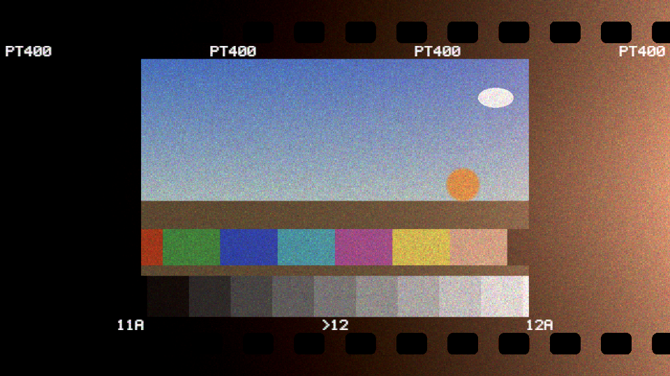
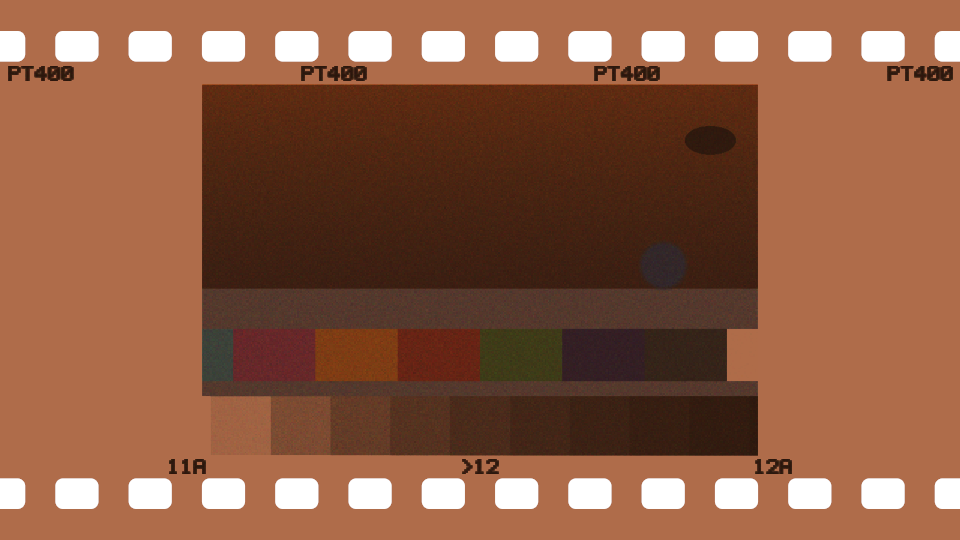

# Rebate user guide

Rebate is **colour negative film, and the scan of it, for [Resolume](https://resolume.com) Arena
and Avenue**, as an FFGL effect. It is not a lookup table. The clip is treated as the scene: it
exposes the three layers of a colour negative, each layer is developed along a characteristic
curve into dye, the dyes' impurities are cancelled by an orange mask, the dye is realised as
grain, and then the orange negative is scanned and inverted the way a lab scanner does it. The
orange negative, the grain, blue shadows on expired stock, a warm light leak, cross-processing and
the black rebate round the frame are each one of those stages doing what it does. None of them is
drawn.



*The harness's test card through the plugin, rendered by the offline harness rather than
captured from Resolume. Portrait 400 on a 35 mm strip, with a leak from the right.*

> **Before you rely on this:** first released at **v0.1.0**, and honestly early. The film is
> measured rather than asserted, by a harness that drives the real plugin class, at two
> resolutions: a grey wedge's density climbs with slope 0.57948 for a stated γ of 0.58, inside a
> band derived from the curve's own bends, and the toe and shoulder land 1.2e-3 log units from
> where the curve says; a neutral wedge through C-41 with its orange mask, scanned manually,
> comes out neutral to 1.1e-6; grain variance at half coverage is 1.9158e-2 against a predicted
> 1.9159e-2 over 921,600 samples, and peaks there in every channel; one stop of push reads back
> γ × 1.15000 and fog +0.030000; a leak adds density along the curve and stops at its shoulder;
> every unclipped step of a cross-processed wedge scans R > G > B; the sprocket holes and the
> rebate are exactly black in the positive. Eleven deliberately broken versions of the model
> were each caught by those checks. All 22 controls measurably change the picture. It **has not
> been loaded into Resolume yet**. The one host it has run in is the fleet's own test host,
> `oxbow`, for 120 frames. The only pictures anyone has judged it on are a synthetic test card
> and Resolume's own demo clips put through the harness.
> Try it on a spare layer before you put it in a show.
>
> This codebase was created with AI assistance, directed and reviewed by a human author.

---

## Installing

Every download carries one effect, **SW Rebate**. Drop it into Resolume's effects folder and
restart Resolume:

```
macOS    ~/Documents/Resolume Arena/Extra Effects/
Windows  %USERPROFILE%\Documents\Resolume Arena\Extra Effects\
```

Avenue uses the same layout under its own folder name. The effect then appears in the effects
browser as **SW Rebate**.

The macOS download is a universal build (Apple silicon and Intel), as a `.dmg` or a `.zip`. It is
**Developer ID-signed and notarised**, so the bundle simply loads. The
Windows download is an x64 installer or a `.zip`. It is not code-signed, so the installer trips
SmartScreen once: **More info** → **Run anyway**.

---

## A film look that is the process

A film look is usually a lookup table: a fixed mapping from each input colour to an output
colour, fitted to what some stock looked like once. Rebate runs the process instead, in order:

1. **Exposure.** The clip, decoded to linear light, is the scene. It exposes three layers — red-,
   green- and blue-sensitive — through a small overlap between their sensitivities, as real
   layers do. A neutral scene exposes all three equally.
2. **Development.** Each layer climbs a **characteristic curve**: a toe where the shadows start
   to register, a straight line of slope γ (the stock's contrast), and a shoulder where the
   highlights stop adding density. The film holds about nine stops between toe and shoulder.
3. **Dye and the mask.** The red layer forms cyan dye, the green magenta, the blue yellow. Real
   dyes absorb some light they should not, so a colour negative carries **masking couplers**:
   coloured wherever dye did *not* form, and carrying exactly the unwanted absorption that dye
   would have had. The total is the same everywhere: a constant **orange**. That is why a
   negative is orange, and why the scanner can divide it out and leave the colours clean.
4. **Grain.** The dye forms as clouds in grain cells. Each cell has a fixed number of sites a
   cloud can land on, and the fraction covered varies from cell to cell like any count.
5. **The scan.** The flat, orange, inverted negative is scanned: the base divided out, black and
   white points set, inverted, and a scanner gamma applied.

Everything an operator would call "film" comes out of one of those steps. Because each control
acts on its own stage, they interact the way film does: over-exposure rolls off because the
curve has a shoulder, a leak cannot burn past white because it is an exposure going through that
same curve, and grain is loudest in the mid-tones because a count varies most when half the
sites are covered.



*`View: Negative`: what is on the film before the scanner inverts it.*

---

## Start here

Put SW Rebate on a layer with something in it and leave every control alone. The defaults are
**Portrait 400, normally exposed and developed in C-41, grain at about a third of its physical
strength, scanned manually with the lab's C-41 profile, on a 35 mm strip**. The picture sits in a
3:2 frame in the middle of the output with a black border round it and light edge print above
and below.

Then, in this order:

1. **View → Negative.** The film itself, on a light box: an orange strip, the picture inverted,
   clear sprocket holes along both edges. Put it back to **Positive**.
2. **Exposure.** Take it down three stops and the shadows sink into the toe. Take it up three and
   the highlights roll off on the shoulder instead of clipping hard.
3. **Leak Amount.** Raise it and a warm light leak burns in from the right edge, across the
   picture and the border alike. In the border it shows up the sprocket holes, which are black
   on black until something lights the film round them.
4. **Stock → Expired 400**, or raise **Age**. The shadows go blue and the highlights warm.
5. **Process → Cross.** Slide film through negative chemistry: steep, warm, most of all in the
   shadows.

**Manual scan is the default on purpose.** A real lab scanner re-measures every roll and takes
most of an exposure error, an age cast or a missing mask straight back out again: those are, to
a first order, per-channel offsets and scales, which is exactly what per-channel levels remove.
With a manual scan every control does what it says. For badly exposed footage that you simply
want to look like film, turn on **Auto Levels**: that is the lab doing its job.

**Format → Full** drops the strip and puts the scanned picture in the whole frame. Everything
but Edge Text On and Frame Number still works there.

---

## Time comes from the host

Two things read the host's clock: the grain, which re-draws at 24 film frames a second of host
time, and Auto Levels' smoothing. Everything else is a function of the picture and the controls
alone. Because the grain is a pure function of the film frame, the seed and the pixel, a
re-render of the same composition frame grains the same frame the same way, and grain stands
still when the host's clock stops.

For the first few frames after it loads, the effect runs on its own steady clock while it works
out whether the host counts time in seconds or milliseconds. Then it switches to the host's.

---

## The Scene group

**Exposure** — the camera's exposure, from −6 to +6 stops, linear: 0 in the middle (the
default), one stop for every twelfth of the travel. It multiplies the scene's light before the
film sees it, so it goes through the curve. Under-exposed, the shadows fall into the toe and
flatten; over-exposed, the highlights compress on the shoulder. The film holds about nine
stops between the two, with mid grey a little over four stops above the toe. With Auto Levels
on, the scanner takes most of an exposure change back out.

**Stock** — five invented films, described by their parameters rather than copied from any real
product:

| Stock | Edge print | Kind | γ | Grain sites a cell | Fog | Age |
| --- | --- | --- | --- | --- | --- | --- |
| **Fine 100** | FN100 | negative | 0.62 | 64 | 0.10 | 0 |
| **Portrait 400** (default) | PT400 | negative | 0.58 | 32 | 0.14 | 0 |
| **Grain 800** | GR800 | negative | 0.60 | 14 | 0.18 | 0 |
| **Slide 100** | SL100 | reversal | 0.60 | 56 | 0.08 | 0 |
| **Expired 400** | PT400 | negative | 0.58 | 28 | 0.14 | 0.6 |

γ is the contrast of the straight line as a colour negative. **Grain sites** is how many places
in one grain cell a dye cloud can form: fewer sites, coarser grain (the variance is one over the
number of sites). **Fog** is the density the film has with no exposure at all. **Expired 400** is
Portrait 400 that has sat on a shelf: it carries an age of 0.6 of its own, and the edge print
still says PT400. **Slide 100** is a reversal film: it has no masking couplers, so it is never
orange, and in C-41 it is cross-processed (see Process).

**Push** — extra development, from −1 (a one-stop pull) to +3 stops, linear, 0 at a quarter of
the travel (the default). Each stop of push raises γ by 15% and adds 0.03 of chemical fog; a pull
does the opposite. Push is development only: the under-exposure that usually goes with a push on
a shoot is Exposure's job, so for a classic "shot at 1600, pushed two stops", take Exposure down
two stops and Push up two.

**Age** — how long the film sat before it was shot, 0 to 1, linear. It is added to the stock's
own age (0.6 for Expired 400) and the total stops at 1. Age does two things. It fogs the film as
an **exposure** — radiation and heat in storage — which goes through the curve, so it lifts the
shadows and leaves the highlights, and the top, blue-sensitive layer takes the most of it. And it
costs speed, the blue layer most. Scanned with the stock's normal profile, the shadows go blue
and the highlights warm. Auto Levels takes most of the cast back out, which is true to life: a
lab would.

---

## The Process group

**Process** — the chemistry: **C-41** (the default), **E-6** or **Cross**.

- **C-41** — colour negative chemistry. A negative stock develops into an orange negative, which
  the scanner inverts. **Slide 100 in C-41 is cross-processing**, identical to choosing Cross.
- **E-6** — reversal chemistry: the film comes out a positive, and the scanner does not invert.
  Slide 100 in E-6 is a slide as designed, steep and short. A **negative** stock in E-6 is
  reverse cross-processing: a flat positive that keeps its orange mask.
- **Cross** — the film is treated as reversal film developed in C-41 whatever the stock: a
  negative, steep (about twice the γ) and short, with **no masking couplers**, because reversal
  film never had any. The scanner still expects a masked C-41 negative and divides by an orange
  mask that is not there, so the result goes warm, most in the shadows, the shift shrinking
  toward the highlights where the mask it expected would have been used up.

**Mask On** — the masking couplers, on by default. Off, a negative stock has no orange mask, the
dyes' impurities are not cancelled, and the manual scanner still divides by the mask it expects:
the picture goes dark and red, and colours go muddy. With Auto Levels on, neutrals come back
almost neutral — per-channel levels hide a missing mask on greys, which is historically why the
mask was needed for printing at fixed filtration and not for a lab that re-measures — but the
colours stay muddier. Mask On does nothing for Slide 100 or under Cross, which have no couplers
either way.

**Under E-6 with a manual scan** the picture is a positive, so it is dense where the scene was
dark: **Black Point** sets the density that prints *white* and **White Point** the density that
prints *black*, and both are scaled for a negative's density range. A slide in E-6 comes out
dark and hard at the defaults, and a negative stock in E-6 dark and red. **Turn on Auto Levels
for E-6**; it measures the film's own range and suits it better.

---

## The Grain group

Grain acts on how much of each layer developed (its **coverage**, 0 to 1), not on the output
colour. Each grain cell of each layer holds a stock's worth of sites, each covered by a dye cloud
with a probability equal to that coverage, and the fraction actually covered is what forms dye.
A count like that varies most at half coverage and not at all when nothing or everything is
covered, so grain is **loudest in the mid-tones and absent in clear shadows and blocked
highlights**, with nothing tuned to put it there.

**Grain Amount** — how much of that fluctuation to keep, 0 to 1, linear. 1 is the full physical
figure for the stock's number of sites; 0 is exactly none. The default is 0.35: the full figure
at 32 sites is heavier than most operators want.

**Grain Size** — the size of a grain cell, from 1 to 8 output pixels, geometric: 2 px at a third
of the travel, 4 at two thirds. The default is 1.5 px. Grain is counted in **output pixels** from
the top-left, not in millimetres of film, so the same setting looks relatively finer at 4K than
at 720p. At video-streaming sizes a 1.5 px cell is easily compressed away; 3 px cells (about 0.53
on the slider) at a high Grain Amount survive.

**Grain Seed** — 0 to 999, default 1. The same seed, the same film frame and the same pixel
always give the same grain. Change it for different grain on a second layer of the same clip.

---

## The Leak group

A light leak is light getting in through the camera back and reaching the film through its base,
which the red-sensitive layer, nearest the base, sees first. It is an **exposure**, added to the
scene's before the curve, so it saturates on the shoulder rather than adding without limit, and
it fogs the whole film at that edge, rebate included — which is when the sprocket holes show up.

**Leak Amount** — 0 (the default) is no leak at all. Above that, the leak's exposure at its edge,
from 4 stops under mid grey at the bottom of the travel to 10 stops over at the top, geometric:
mid grey at about 0.29, four stops over at about 0.57. The top of the travel burns to white.

**Leak Edge** — which edge of the output it comes from: **Left**, **Right** (the default),
**Top** or **Bottom**. It is also a little stronger along the middle of that edge than at its
ends.

**Leak Warmth** — the leak's colour, 0 to 1, linear, default 0.8. At 0 it exposes all three
layers equally and comes out neutral; at 1 it exposes the red layer fully, the green at 30% and
the blue at 6%, which scans as a warm orange.

**Leak Spread** — how far the leak reaches in: the distance over which it falls off, from 0.05 to
1 frame height, geometric. The default is 0.3 of a frame height, at about 0.6 on the slider. The
distance is measured from the edge of the output, whatever the Format.

---

## The Scan group

**View** — **Positive** (the default) or **Negative**.

- **Positive** — the scan: inverted for a negative, as it came for a slide.
- **Negative** — the film itself on a light box, with nothing inverted and no levels: orange for a
  C-41 negative, the edge print dark, the sprocket holes clear. Under Cross it is a negative with
  no orange. Auto Levels, Black Point, White Point and Scanner Gamma do nothing in this view.

**Auto Levels** — off by default. On, the scanner measures each frame itself, per channel: the
least and most dense of 64×36 blocks of the picture area (blocks rather than pixels, so one
specular highlight does not set the white), smoothed over about a quarter of a second. It takes
its first measurement outright on the first frame and whenever it is switched on, so there is no
fade in from black. It removes most of an exposure change, an age cast and a missing mask, as a
lab does, and it is the right setting for E-6 and for footage that needs help. Black Point and
White Point do nothing while it is on.

**Black Point** — for a negative, the density above the film's base (as the scanner's profile
expects it) that prints black: 0 to 0.6, linear, default 0.05. Raise it and the shadows crush.

**White Point** — for a negative, the density above the base that prints white: 0.6 to 3.0,
linear, default 1.25. Between the defaults there are about seven stops of scene at Portrait
400's γ. Lower it and the highlights blow sooner; raise it and the whole picture darkens.

**Scanner Gamma** — the scanner's tone curve, 0.5 to 2, geometric, exactly 1 in the middle (the
default). Below 1 the picture gets lighter and flatter; above 1, darker and more contrasty in the
mid-tones.

For a manual scan of a negative, the scanner's profile is always the stock's **fresh, normally
developed, masked C-41** profile, whatever the film really is. That is what makes an expired roll
go blue and a cross-process go warm, and it is what a lab does when it runs a roll as C-41. Under
E-6 the profile is an unmasked slide's.

---

## The Frame group

**Format** — **Full**, **6x6** or **35 mm** (the default).

- **Full** — no film round the picture: the scan fills the output.
- **6x6** — 120 roll film, 61.5 mm wide, a square 56 mm frame, no perforations. The stock code is
  printed in the top margin; there are no frame numbers, because 120 carries them on its backing
  paper, not the film.
- **35 mm** — a 36×24 mm frame on a 35 mm strip, the common negative perforation, the stock code
  above the frame and frame numbers below it.

The strip runs across the output and the film's full width fills its height, the way a strip
scanner sees it. The clip is centre-cropped to the frame's shape (3:2, or square), and everything
outside the frame is unexposed film. In the positive, unexposed film prints black and the holes
print black too; the edge print, exposed at the factory, prints light. In the negative the holes
are clear.

**Edge Text On** — the edge print, on by default. It is a latent image, exposed well up the
curve, so it prints light in the positive and dark on the negative. The codes are the stock's
(see the Stock table) and the numbers are invented; no real manufacturer's name or mark appears.

**Frame Number** — the number printed under the frame, 0 to 99, default 12. The 35 mm strip
prints **>12** under the frame's centre and **11A** and **12A** at the half frames either side;
numbers wrap past 99. It does nothing in 6x6 or Full.

**Mix** — the scan against the untouched clip, 0 to 1, default 1. At 1 the output is exactly the
scan and fully opaque: film is opaque, and the black rebate is part of the picture, not
transparency. Below 1 the output, alpha included, is mixed towards the clip's.

---

## How it works

Once a frame, in up to five passes:

1. **Copy.** The clip into a float texture of the effect's own.
2. **The film.** For every output pixel: where it falls on the film (the frame, the rebate, a
   hole, the edge print), the scene there reduced into the frame, the layers' exposures — scene,
   age fog, edge print and leak — and the curve, to how much of each layer developed.
3. **Blocks** and 4. **levels**, only with Auto Levels on in the Positive view: mean channel
   densities of up to 64×36 blocks of the picture, then the least and most dense, smoothed.
5. **The scan.** Grain on the coverage, dye, the mask, transmittance through the film and the
   holes, then the scanner, then Mix, straight to the output.

The numbers that describe the film — curve, base, dye impurities, layer overlap, ageing, the five
stocks — live in one file, and the shaders are assembled from one library of the model's
arithmetic, so the effect and the harness that measures it agree on what a stock is.

---

## Performance

Measured by the offline harness on an M4 Max at the default controls, best of three runs of 60
frames after a warm-up, on a GPU shared with other work:

| | ms/frame | % of a 60 fps frame |
| --- | --- | --- |
| 1280×720 | 0.20 | 1.2% |
| 1920×1080 | 0.33 | 2.0% |
| 2560×1440 | 0.54 | 3.2% |
| 3840×2160 | 1.19 | 7.2% |

**Auto Levels** adds its block reduction: about 0.6 ms more at 4K. The grain loops over the stock's
grain sites, so Fine 100 (64) does the most work of the five; that was not timed separately. If
the effect cannot allocate its buffers it does nothing and says so in the log.

Nothing was timed inside Resolume, and nothing was timed on Windows.

---

## If it looks wrong

**Nothing seems to happen.** Check Mix. At the defaults the 35 mm strip is plainly there on any
clip, so if even that is missing, see *The effect does nothing at all* below.

**The picture is small, in a black frame.** That is the 35 mm Format. Set **Format → Full** for
the whole frame.

**There are no sprocket holes.** In the positive they print black on a black rebate. They show
in **View → Negative**, or where a leak lights the film round them. 6x6 has none.

**Exposure, Age or Cross do almost nothing.** Auto Levels is on and is taking them back out, as a
lab would. Turn it off.

**E-6 is dark, or dark and red.** The manual scan's points are scaled for a negative. Turn on
Auto Levels.

**Everything is dark and red.** Mask On is off, or the Process is E-6 with a negative stock.

**I can't see the grain.** At 1.5 px cells and 0.35 it is fine, and video compression removes
fine grain first. Raise Grain Size and Grain Amount, or choose Grain 800.

**The grain looks the same on two layers.** Same seed, same clip time: give one a different
Grain Seed.

**The effect does nothing at all.** A shader that will not compile looks exactly like that, and
so does a buffer too large to allocate. The real message is in the log:

```
macOS    ~/Library/Logs/rebate/rebate.YYYY-MM-DD.log
Windows  %LOCALAPPDATA%\rebate\logs\rebate.YYYY-MM-DD.log
```

It records the GL vendor and version at load, which shader failed if one did, and the buffer size
if it could not be allocated.

---

## Known limits

- **Not loaded into Resolume yet**, and nothing has driven the controls in a host. How 22
  controls in six groups read in the inspector and what a long session's clock does to the grain
  are untested.
- **The stocks are invented**, described by their parameters (γ, grain sites, fog, age), not
  measured from any real film. The constants were chosen by reasoning and by eye on a test card.
- **Three numbers per dye**, not spectral dye curves; no interlayer effects, no adjacency
  (edge) effects, no halation, no gate weave, no dust. A real scanner's colour matrix and tone
  curve are one levels step and one gamma here.
- **Grain is per output pixel**, not per micron of film, so it does not scale with the frame.
- **The scene is reduced into the film frame** by a four-tap filter, good for the reduction the
  formats need (at most about 1.6×).
- **The rest of the strip is unexposed**: no neighbouring frames either side.
- **The host clock handling has only met the harness's clock.** It is the same approach as the
  fleet's readout effect, which has met Arena. This effect has not.
- **Not verified at 4K**, only timed there.
- **No presets**, no OpenFX version and no browser demo. The Stock menu is the nearest thing to a
  preset list.

---

## About

The last group, **About**, carries the plugin's name, version, licence and maker, and buttons
that open the project page, the source on GitHub and the support page in your browser.

## Reporting something

[github.com/stoatworks-labs/rebate/issues](https://github.com/stoatworks-labs/rebate/issues).
A screenshot, the Stock, Process, View and Auto Levels settings, and the composition's resolution
are usually enough.
